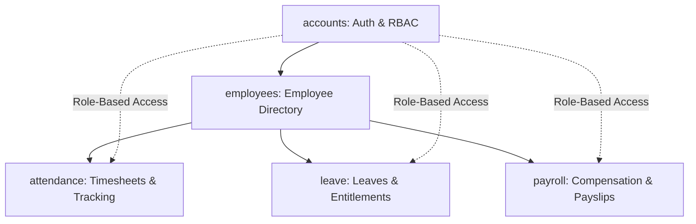

# Dayflow HRMS — Comprehensive Backend Documentation

## 1. System Overview & Architecture

Dayflow HRMS is an enterprise Human Resource Management System backend built with **Django 5.2.17**, **Python 3.13.7**, and **MySQL 8.0**. The backend architecture is modular, decoupled into five specialized Django applications:



### Module Responsibilities:
1. **`accounts`**: Custom `User` model, role-based access control (`ADMIN`, `HR`, `EMPLOYEE`), mandatory first-login password change middleware, and authentication session security.
2. **`employees`**: Core workforce domain models (`Company`, `Department`, `Designation`, `Employee`), auto-generated sequential Employee IDs and Login IDs, and onboarding service workflows.
3. **`attendance`**: Daily check-in/check-out tracking, work duration calculation, punctuality classification (`PRESENT`, `LATE`, `WFH`, `ABSENT`), and attendance management dashboards.
4. **`leave`**: Leave type catalogs, annual leave balances (`total_allocated`, `used_days`), application lifecycle (`PENDING` -> `APPROVED` / `REJECTED` / `CANCELLED`), balance deductions, and attachment handling.
5. **`payroll`**: CTC breakdown calculations (Basic, HRA, Standard Allowances, Performance Bonus, PF, PT, TDS), atomic monthly payslip generation, PDF generation engine (`ReportLab`), and disbursement tracking.

---

## 2. Database Schema & Data Models

All models are connected via relational foreign keys with MySQL index optimization and data integrity constraints.

### Key Relationships
- **User ↔ Employee**: `OneToOneField(User, related_name='employee_profile')`
- **Employee ↔ Attendance**: `ForeignKey(Employee, related_name='attendance_records')`
- **Employee ↔ LeaveRequest**: `ForeignKey(Employee, related_name='leave_requests')`
- **Employee ↔ LeaveBalance**: `ForeignKey(Employee, related_name='leave_balances')` (Unique together: `[employee, leave_type, year]`)
- **LeaveRequest ↔ User (Approver)**: `ForeignKey(User, related_name='approved_leaves')`
- **Employee ↔ SalaryStructure**: `OneToOneField(Employee, related_name='salary_structure')`
- **Employee ↔ Payslip**: `ForeignKey(Employee, related_name='payslips')` (Unique together: `[employee, month, year]`)

---

## 3. Authentication, RBAC & Security

### Role-Based Access Matrix

| Feature / Action | Admin | HR | Employee |
| :--- | :--- | :--- | :--- |
| **User & Role Management** | Full Control | View / Create | Own Profile Only |
| **Employee Directory** | Full CRUD | Full CRUD | Own Profile (Read / Limited Edit) |
| **Attendance Records** | Org-wide View & Edit | Org-wide View & Edit | Self Check-in / Out & Own History |
| **Leave Types** | Create / Edit / Delete | Create / Edit / Delete | Read-Only Catalog |
| **Leave Applications** | Approve / Reject / View All | Approve / Reject / View All | Self Apply & Cancel (if Pending) |
| **Salary Structures** | Create / Edit / View All | Create / Edit / View All | Hidden / No Direct Access |
| **Payslips & PDF** | Generate / Pay / View All | Generate / Pay / View All | View Own Payslips & Download PDF |

### Security Measures
- **CSRF Protection**: Enabled across all state-mutating POST requests.
- **Login Enforcement**: `@login_required` on all protected routes.
- **Mandatory First-Login Password Change**: `FirstLoginPasswordChangeMiddleware` intercepts any request from users with `must_change_password=True` and redirects to `/accounts/password-change/`.
- **Object-Level Ownership Security**: `check_employee_ownership_or_403()` and `get_accessible_employee_queryset()` ensure employees can never access or tamper with other employees' records.
- **Inactive User Lockout**: Deactivated users (`is_active=False`) are blocked by Django authentication backend.
- **Password Security**: Standard PBKDF2 with SHA-256 password hashing. Passwords and credentials are never stored in plaintext or logged.
- **Environment Isolation**: Database credentials and secret keys are loaded via `.env` (ignored by Git).

---

## 4. Complete URL Route Directory

### Accounts (`/accounts/`)
- `GET/POST /accounts/login/` (`accounts:login`) — User authentication
- `GET/POST /accounts/logout/` (`accounts:logout`) — Session termination
- `GET/POST /accounts/password-change/` (`accounts:password_change`) — Password update & first-login reset
- `GET /accounts/dashboard/` (`accounts:dashboard`) — Main navigation dashboard

### Employees (`/employees/`)
- `GET /employees/` (`employees:employee_list`) — Employee directory
- `GET /employees/<id>/` (`employees:employee_detail`) — Profile detail
- `GET/POST /employees/create/` (`employees:employee_create`) — Onboard employee
- `GET/POST /employees/<id>/edit/` (`employees:employee_edit`) — Edit employee
- `POST /employees/<id>/deactivate/` (`employees:employee_deactivate`) — Deactivate user

### Attendance (`/attendance/`)
- `GET /attendance/dashboard/` (`attendance:dashboard`) — Attendance hub & stats
- `GET /attendance/` (`attendance:attendance_list`) — Org-wide attendance records
- `GET /attendance/my/` (`attendance:my_attendance`) — Self attendance history
- `POST /attendance/check-in/` (`attendance:check_in`) — Check-in action
- `POST /attendance/check-out/` (`attendance:check_out`) — Check-out action
- `GET /attendance/<id>/` (`attendance:attendance_detail`) — Record detail

### Leave (`/leave/`)
- `GET /leave/dashboard/` (`leave:dashboard`) — Leave management hub
- `GET /leave/` (`leave:leave_list`) — Org-wide leave requests
- `GET /leave/my/` (`leave:my_leave`) — Self leave history & balances
- `GET/POST /leave/apply/` (`leave:leave_apply`) — Submit leave request
- `GET /leave/<id>/` (`leave:leave_detail`) — Request detail
- `POST /leave/<id>/approve/` (`leave:leave_approve`) — Approve leave & deduct balance
- `POST /leave/<id>/reject/` (`leave:leave_reject`) — Reject leave request
- `POST /leave/<id>/cancel/` (`leave:leave_cancel`) — Cancel pending leave
- `GET /leave/<id>/attachment/` (`leave:leave_attachment_download`) — Download medical/proof file
- `GET /leave/types/` (`leave:leave_type_list`) — Manage leave types

### Payroll (`/payroll/`)
- `GET /payroll/dashboard/` (`payroll:dashboard`) — Payroll summary & metrics
- `GET /payroll/` (`payroll:salary_list`) — Salary structures directory
- `GET /payroll/salary/<id>/` (`payroll:salary_detail`) — Salary breakdown view
- `GET/POST /payroll/salary/create/` (`payroll:salary_create`) — Assign salary structure
- `GET/POST /payroll/salary/<id>/edit/` (`payroll:salary_edit`) — Update salary structure
- `GET /payroll/payslips/` (`payroll:payslip_list`) — All generated payslips
- `GET /payroll/my-payslips/` (`payroll:my_payslips`) — Employee self payslips
- `GET/POST /payroll/payslips/generate/` (`payroll:payslip_generate`) — Batch/single payslip generator
- `GET /payroll/payslips/<id>/` (`payroll:payslip_detail`) — Payslip view
- `GET /payroll/payslips/<id>/pdf/` (`payroll:payslip_pdf`) — PDF download
- `POST /payroll/payslips/<id>/payment-update/` (`payroll:payslip_payment_update`) — Mark PAID

---

## 5. Payroll & Compensation Formulas

The payroll module applies statutory Indian payroll computations:
- **Basic Salary**: `50%` of Monthly Wage (Annual Wage / 12)
- **HRA (House Rent Allowance)**: `50%` of Basic Salary (`25%` of Monthly Wage)
- **Standard Allowances**: Remaining `25%` of Monthly Wage (Conveyance, Medical, Special Allowance)
- **Gross Monthly Wage**: `Basic + HRA + Allowances`
- **Provident Fund (PF)**: `12%` of Basic Salary
- **Professional Tax (PT)**: `₹200.00` per month
- **Total Deductions**: `PF + PT + TDS`
- **Net Salary**: `Gross Earnings - Total Deductions`

---

## 6. Test Suite & Verification Matrix

The test suite covers **110 automated test cases** across all modules:
- **`apps.accounts`**: 10 tests (Login, session logout, password hashing, inactive lockout, first-login redirection).
- **`apps.accounts.tests_integration`**: 5 tests (Complete 12-step end-to-end business lifecycle, cross-module foreign key relationships, 9-point ID tampering matrix, security lockout, and PBKDF2 verification).
- **`apps.employees`**: 28 tests (Employee creation, sequential Login ID generation, department filtering, ownership permissions).
- **`apps.attendance`**: 18 tests (Check-in/out, work duration calculation, LATE status threshold, duplicate rejection, tamper security).
- **`apps.leave`**: 18 tests (Balance initialization, leave application, balance deduction on approval, rejection/cancellation, attachment downloads).
- **`apps.payroll`**: 31 tests (Salary structure computation, payslip generation, duplicate prevention, payment status update, PDF generation, RBAC).

### Running Tests
```bash
python manage.py test
```
Result: **`110 passed, 0 failures, 0 errors`**.
